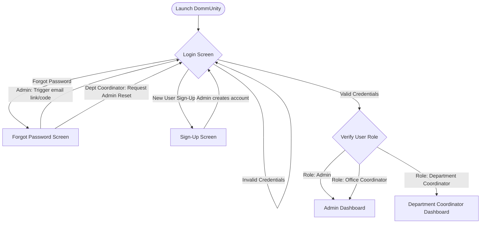
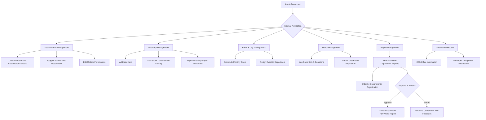
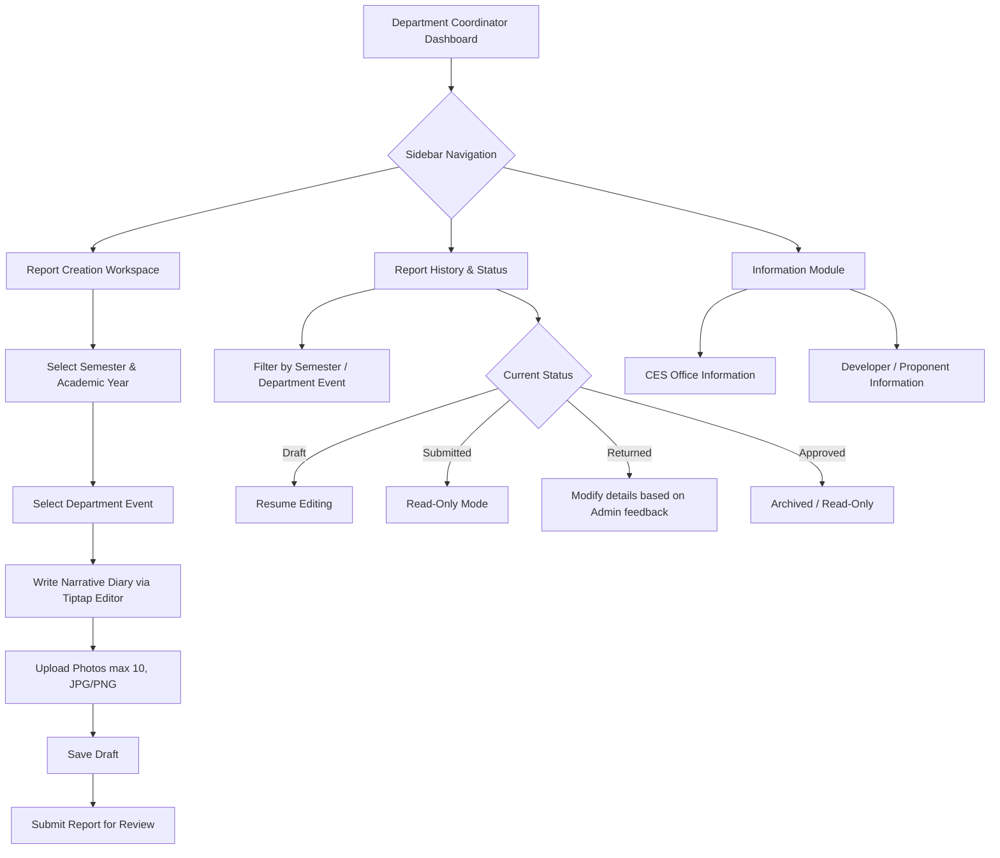

# Application Flow: DommUnity

This document maps out the application states, navigation structures, and interactive processes for all user roles (Admin, Office Coordinator, and Department Coordinator) in the **DommUnity** system.

---

## 1. Authentication & Role Gateway Flow

---

## 2. Administrator Flow & Journeys

The Administrator (Head of CES Office) and Office Coordinator (Mr. Jonnel B. Manio) share the same dashboard. They manage settings, inventory, departments, donors, create department coordinator accounts, and review submitted reports.

### 2.1 Key Admin Procedures
1. **Inventory Sorting (FIFO & Expiration-based):**
   - System receives a release request for items.
   - Core algorithms filter by item category.
   - Items are queued sorting by **First In, First Out (FIFO)** and **nearest expiration date** to ensure zero product wastage.
   - **Batch-Level Tracking:** Identical items (e.g., canned sardines) with different expiration dates are stored as separate inventory rows. Each batch has its own quantity, received date, and expiry date, enabling granular per-batch monitoring.
   - **Expired Detection:** Items whose expiration date has passed are automatically flagged as `Expired` and excluded from distribution recommendations.
   - **Expiring Soon Alerts:** The dashboard sidebar proactively warns about consumable batches approaching expiration within 30 days.
2. **Reviewing Narrative Reports:**
   - Reports under `Submitted` status appear on the Admin Dashboard.
   - Admin reviews the rich text diary content and attached media (up to 10 photos).
   - Approving the report locks the status to `Approved` and allows compilation. Returning shifts the status to `Returned`, alerting the department coordinator.

---

## 3. Department Coordinator Flow & Journeys

Each department has a designated coordinator who compiles narrative reports for their department's outreach programs and tracks their assigned events. Department Coordinators can only access reports and events related to their assigned department.

### 3.1 Key Department Coordinator Procedures
1. **Compiling a Narrative Report:**
   - Department Coordinator opens the **Report Creation Module**.
   - Input fields: Semester, Academic Year, Department Event Selection (only events assigned to their department are shown).
   - Rich Text Area: Uses **Tiptap Editor** to log narrative details of the outreach.
   - Photo Interface: Selects up to 10 local PNG/JPG images (e.g., proof of donation handovers, community interaction).
   - Actions:
     - `Save` changes status to **Draft**.
     - `Submit` moves status to **Submitted** and locks changes.
2. **Reviewing Returned Reports:**
   - If the Admin returns a report, the status shows as **Returned**.
   - The department coordinator selects the report, views the admin's revision notes, applies corrections, and clicks **Submit** again.
