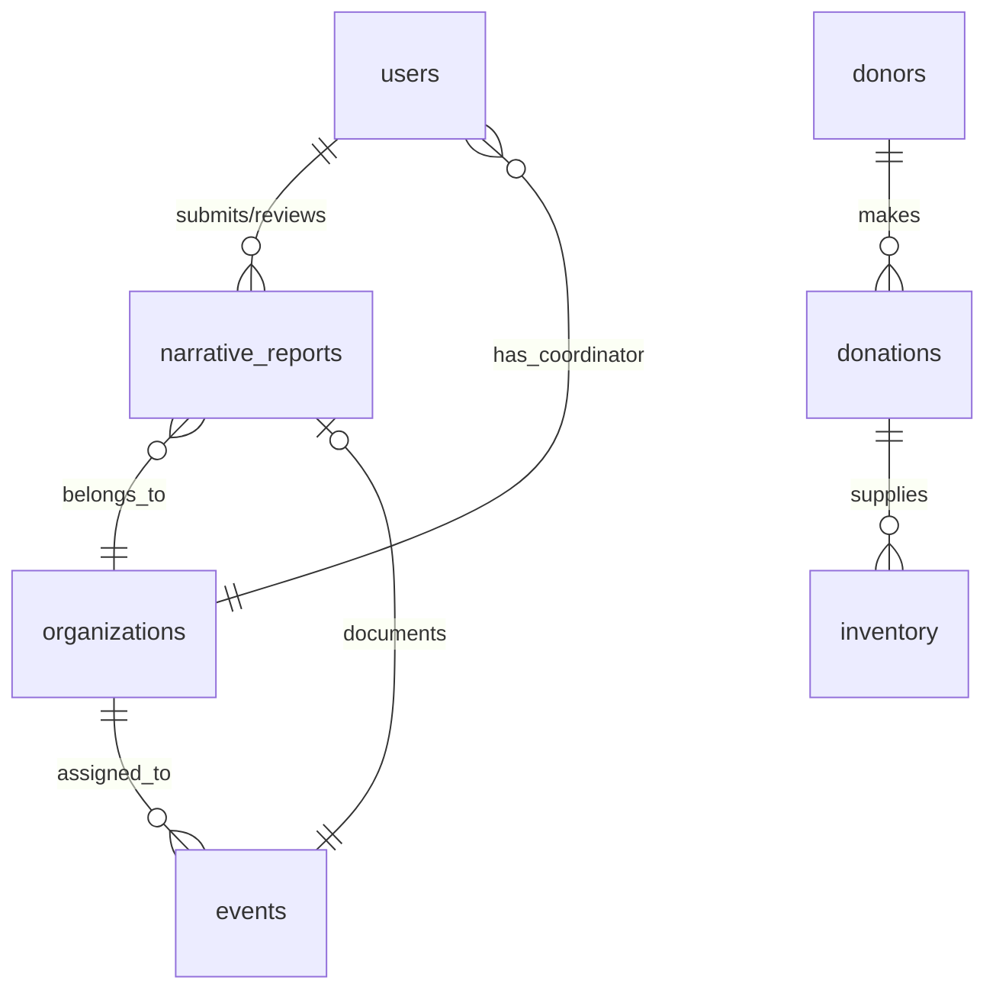

# Backend Schema: DommUnity (Firebase Firestore & Storage)

This document defines the schema for the Firebase Firestore collections and Firebase Storage paths used in **DommUnity**.

---

## 1. Firestore Database Collections



---

### 1.1 `users` Collection

Stores user profiles, credentials, and role definitions.

- **Document ID:** `uid` (Firebase Authentication UID)
- **Fields:**
  ```json
  {
    "uid": "string",
    "username": "string",
    "email": "string",
    "name": "string",
    "role": "string", // "admin" | "office_coordinator" | "department_coordinator"
    "organizationId": "string | null", // Required for department_coordinator; references organizations collection
    "createdAt": "timestamp",
    "updatedAt": "timestamp"
  }
  ```

> **Role Definitions:**
>
> - `admin`: Full system access (Mrs. Faithful Anne F. Arugay)
> - `office_coordinator`: Same access as admin (Mr. Jonnel B. Manio, CES Office Coordinator)
> - `department_coordinator`: Scoped to their assigned department — can only create/submit reports for their department's events

---

### 1.2 `organizations` Collection

Stores departments and organizations within the Dominican College of Tarlac, Inc.

- **Document ID:** Auto-generated UUID / Unique slug (e.g., `dept-cba`, `dept-cs`)
- **Fields:**
  ```json
  {
    "id": "string",
    "name": "string", // e.g., "College of Business Administration"
    "abbreviation": "string", // e.g., "CBA"
    "description": "string",
    "coordinatorId": "string | null", // User UID of the assigned Department Coordinator
    "createdAt": "timestamp"
  }
  ```

---

### 1.3 `inventory` Collection

Tracks physical items for community distribution. Enforces FIFO (First In, First Out) and expiration priority sorting. **Each unique combination of item name and expiration date is stored as a separate document (batch-level tracking).** For example, 8 cans of sardines with 3 different expiry dates are stored as 3 separate inventory documents, each with its own quantity and expiration date.

- **Document ID:** Auto-generated UUID
- **Fields:**
  ```json
  {
    "id": "string",
    "name": "string", // e.g., "Notebooks", "Corned Beef"
    "category": "string", // "school supplies" | "food packs" | "hygiene kits" | "other"
    "unit": "string", // e.g., "pieces", "packs", "boxes"
    "quantity": "number", // Current available stock
    "expiryDate": "timestamp | null", // Null for non-consumables
    "donationId": "string | null", // Reference to specific donation
    "receivedDate": "timestamp", // Used for FIFO tracking
    "status": "string", // "available" (qty > 10) | "low stock" (1 <= qty <= 10) | "out of stock" (qty == 0) | "expired" (expiryDate < today & qty > 0)
    "lastUpdatedBy": "string", // User UID
    "createdAt": "timestamp",
    "updatedAt": "timestamp"
  }
  ```

> **Batch-Level Tracking:** When a donation is logged with items sharing the same name but different expiration dates, the system automatically creates separate inventory documents for each unique expiry date. This enables precise FEFO (First Expired, First Out) sorting and prevents mixing of expiration windows within the same product line.

---

### 1.4 `donors` Collection

Stores profile details of sponsors and school departments who make contributions.

- **Document ID:** Auto-generated UUID
- **Fields:**
  ```json
  {
    "id": "string",
    "name": "string", // e.g., "Jollibee Tarlac", "Senior High School Dept"
    "type": "string", // "internal_department" | "external_sponsor" | "individual"
    "contactEmail": "string",
    "contactPhone": "string",
    "createdAt": "timestamp"
  }
  ```

---

### 1.5 `donations` Collection

Logs batches of items donated by various sources.

- **Document ID:** Auto-generated UUID
- **Fields:**
  ```json
  {
    "id": "string",
    "donorId": "string", // Reference to donors collection
    "dateOfDonation": "timestamp",
    "purpose": "string", // e.g., "Typhoon Relief 2026"
    "description": "string",
    "items": [
      {
        "name": "string",
        "quantity": "number",
        "unit": "string",
        "expiryDate": "timestamp | null"
      }
    ],
    "receivedBy": "string" // User UID (Admin)
  }
  ```

---

### 1.6 `events` Collection

Tracks planned monthly outreach programs and assigns them to school organizations.

- **Document ID:** Auto-generated UUID
- **Fields:**
  ```json
  {
    "id": "string",
    "name": "string", // e.g., "Pamaskong Handog 2026"
    "description": "string",
    "scheduleDate": "timestamp", // Scheduled month and day
    "location": "string", // Target community / beneficiary site
    "assignedOrganizationId": "string", // Reference to organizations collection
    "status": "string", // "planned" | "ongoing" | "completed" | "cancelled"
    "createdAt": "timestamp",
    "updatedAt": "timestamp"
  }
  ```

---

### 1.7 `narrative_reports` Collection

Tracks narrative reports compiled by department coordinators and approved by the admin or office coordinator.

- **Document ID:** Auto-generated UUID
- **Fields:**
  ```json
  {
    "id": "string",
    "eventId": "string", // Reference to events collection
    "authorId": "string", // User UID (Department Coordinator)
    "organizationId": "string", // Reference to organizations collection (scopes report to department)
    "type": "string", // "outreach" | "blood_donation" | "department_program"
    "semester": "string", // "1st Semester" | "2nd Semester"
    "academicYear": "string", // e.g., "2025-2026"
    "narrative": "string", // Rich text / HTML content from Tiptap Editor
    "photos": [
      {
        "url": "string", // Firebase Storage download URL
        "uploadedAt": "timestamp"
      } // Maximum array size: 10
    ],
    "status": "string", // "draft" | "submitted" | "returned" | "approved"
    "adminFeedback": "string | null", // Revision notes if status is "returned"
    "history": [
      {
        "status": "string",
        "changedBy": "string", // User UID
        "timestamp": "timestamp",
        "notes": "string | null"
      }
    ],
    "createdAt": "timestamp",
    "updatedAt": "timestamp"
  }
  ```

---

## 2. Firebase Storage Layout

Narrative photos uploaded by department coordinators are stored in Firebase Storage buckets structured by academic year and events.

```
/narratives/
  ├── AY_2025-2026/
  │   ├── event_event-uuid-101/
  │   │   ├── photo_1.png
  │   │   ├── photo_2.jpg
  │   │   └── ... (Max 10 images)
  │   └── event_event-uuid-102/
  │       └── ...
  └── AY_2026-2027/
      └── ...
```
