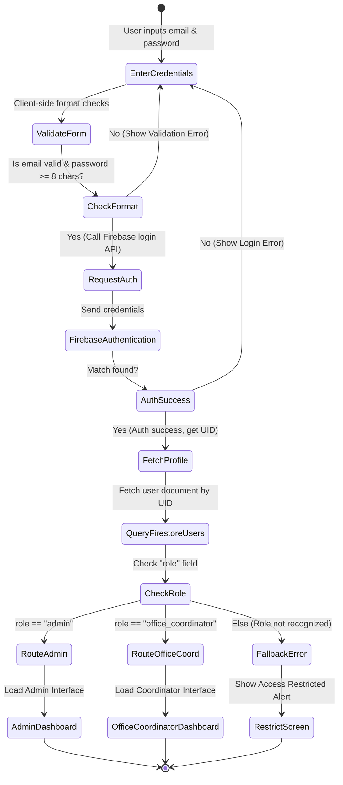
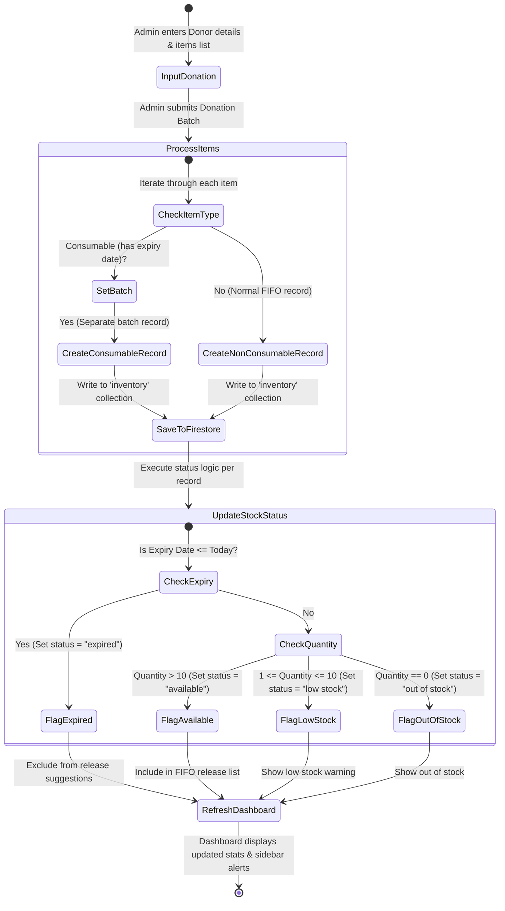
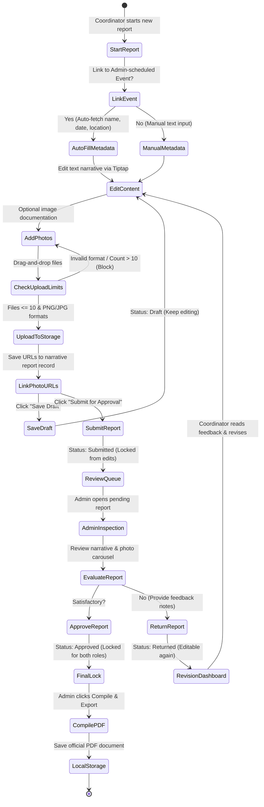
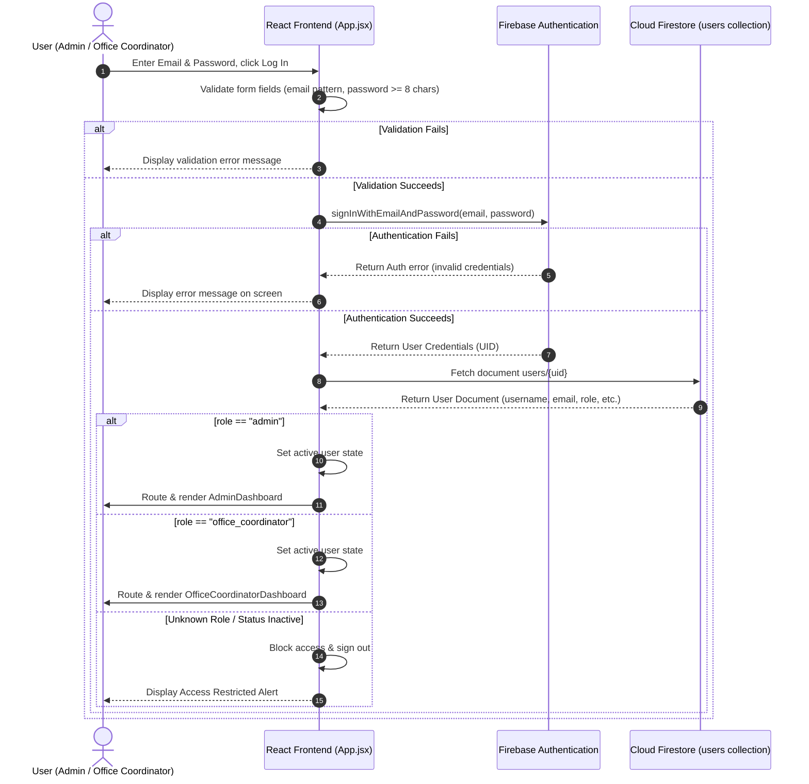
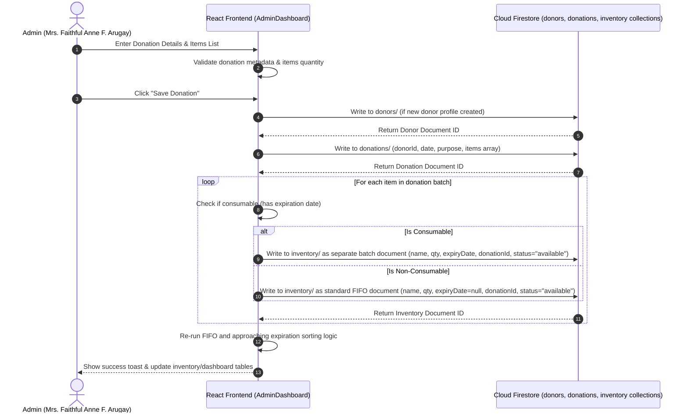
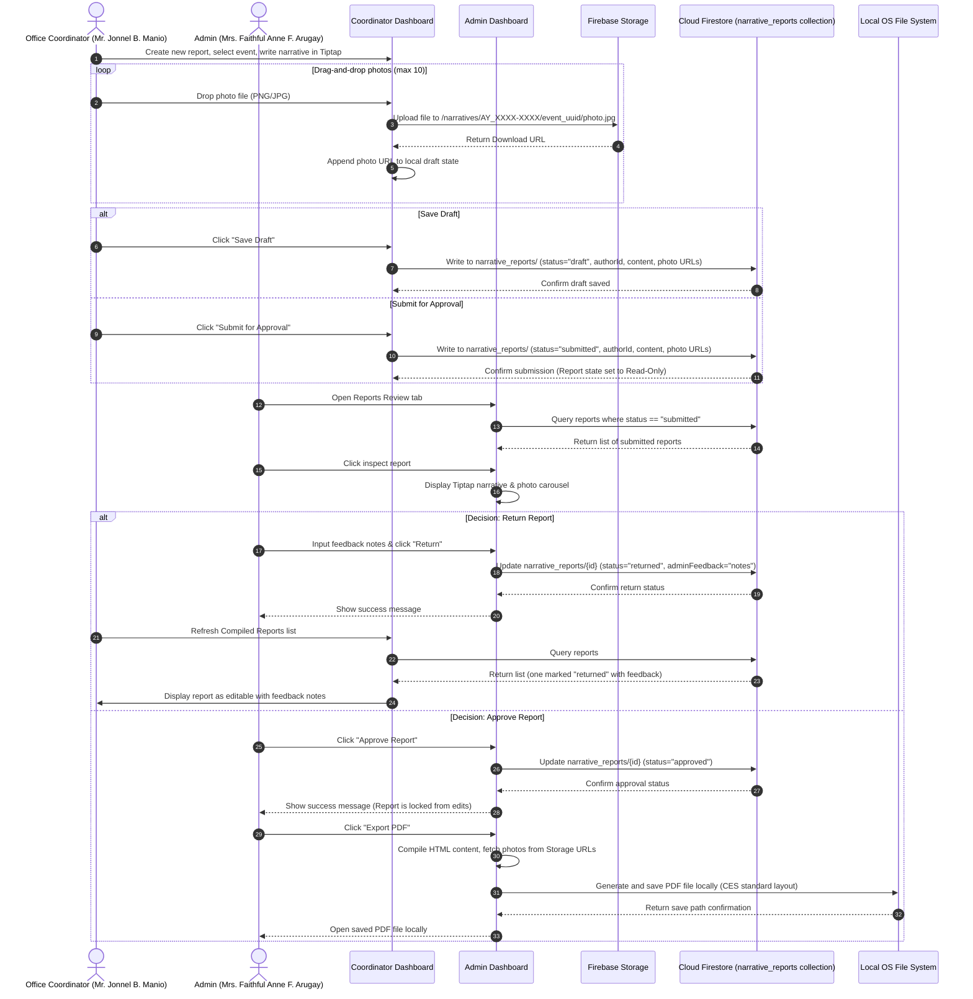

# DommUnity: A Desktop-Based Management System for Community Extension & Services Office of Dominican College of Tarlac, Inc.

## 1.0 Introduction

### 1.1 Project Context
Schools use outreach programs to share resources and expertise beyond campus boundaries. The goal is simple: provide targeted services like health or educational campaigns to communities that need them most. By sending students and professors to conduct seminars, lead relief operations, or teach new skills, universities can tackle immediate social problems head-on. Think of outreach as a one-way street, where the institution transfers its knowledge and assistance directly to a specific group.

Educational institutions have adopted advanced computer programs to assist their offices in managing the various functions of record keeping and other duties. So, the use of paper files such as records, inventories, event schedules and printed narrative reports is reduced. The systems are also capable of organizing data neatly and facilitating the retrieval of files. Digital applications in offices lead to faster output and at the same time, they help avoid wastage due to the loss of essential documents.

Colleges and universities in the Philippines have found a way to apply technology as an instrument of promoting school programs and giving community services. For example, offices that deal with outreach and extension activities are tasked with report preparation, supply management, donation recording, and event monitoring. Prolongation of such assignments is realized when they are made manually. The situation is made worse especially when the mandatory report submission is delayed.

However, community service and extension programs are based on partnership rather than simple charity. Instead of simply dropping off aid, colleges work hand-in-hand with residents to determine the problems they face and develop long-term solutions together. It is a two-way street where residents do not just receive help; they actively shape projects, whether developing new local businesses, advancing literacy or protecting the environment. The end goal is to empower the community, while providing students with invaluable, hands-on learning experiences.

According to the Head of the Community Extension & Services (CES) Office, Mrs. Faithful Anne A. Arugay, sticking to Microsoft Word for narrative reports is making a lot of work and is time-consuming. The Community Extension & Services (CES) office manages different community programs and service activities, specifically outreach gift-giving activities such as donation drives for food packs, school supplies, and hygiene kits. These activities require precise inventory management to ensure that resources are distributed effectively to target communities.

The office keeps records such as inventory of supplies, donor information, event schedules, and narrative reports. At present, narrative reports are prepared using Microsoft Word, where staff manually type the report, insert photos, and fix the format every time. Inventory and donor records are also stored in separate files, which makes tracking and updating information harder than it should be. The inventory management process is also handled manually with records organized into separate items for each year. Items are tracked and removed based on their expiration dates.

Therefore, the office also tracks donations from the school departments which contribute items and resources for community programs, and they report contributions based on the total number of goods (thousands of supplies) to be given away. Event management is currently organized by assigning specific community programs to each department. The programs assigned have specific names, and these events happen every month based on the assigned event for each department.

The proponent chose this project after observing how the CES office works. Being part of the school community, the proponent noticed that manual reporting and record keeping take a lot of time and effort. To address this problem, the project titled "DommUnity: A Desktop-Based Management System for the Community Extension & Services Office of Dominican College of Tarlac, Inc." is proposed. The system aims to make record handling more organized, including inventory tracking, donor records, monthly event schedules by department, and an automatic narrative report that follows the current CES report format.

### 1.1.2 Background of the Study
The Community Extension & Services (CES) office was established in July 2018 to support the school’s mission of service and social responsibility. CES is headed by Faithful Anne A. Arugay and follows the advocacy areas of the Catholic Education Association of the Philippines (CEAP), such as justice and peace, care for the environment, active citizenship, poverty awareness, gender equality, and youth empowerment. The CES office also supervises student organizations like JEEPGY Advocates.

The organizational chart for the Community Extension and Services (CES) office follows a top-down structure that ensures every part of the school is involved in community service. Sr. Lorna I. Ablog, O.P. serves as the School Administrator, Dr. Augusto R. Dela Cruz as the Vice President of Academic Affairs, Mrs. Faithful Anne F. Arugay as the Head of the CES office, and Mr. Jonnel B. Manio as the Coordinator of the CES office.

### 1.2.1 Policies and Procedures
According to Mrs. Faithful Anne A. Arugay, delivering services is under the supervision of the administrator and in close coordination with the Campus Ministry Office. The Department is a potent unit for translating the need of the community and the industry into academic concepts for actual value of practice and genuine life-based learning.

It is then envisioned that the Community Extension and Services will be responsible for community involvement, engagement, and reform towards sustainable development, transforming both institutional and academic values into ground-level exposure and applications addressing significant and relevant challenges and problems of the local community that makes education a pertinent medium for social and ecological improvement.

### 1.2.2 Procedures

#### 1.2.2.1 Outreach and Community Engagement
The Community Extension & Services (CES) office is responsible for managing a wide range of outreach programs and service activities, with a primary focus on gift-giving initiatives and donation drives aimed at providing essential items like food packs, school supplies, and hygiene kits to partner communities.

#### 1.2.2.2 Resource and Inventory Tracking
The office procedures currently dictate that staff must manually maintain records of all incoming and outgoing outreach materials (such as canned foods, hygiene kits, or materials) to ensure precise inventory management, which is vital for tracking available stocks and ensuring resources reach their intended targets without delay.

#### 1.2.2.3 Donor Information Management
The office follows a manual process for recording detailed donor information and specific contributions from different school departments, where they must track and report these contributions based on the total volume of goods—often numbering in the thousands—that are designated for distribution.

#### 1.2.2.4 Monthly Event Coordination
Event management procedures are structured around assigning monthly community service programs to various departments, with each department tasked with specific event names and locations that must be meticulously tracked within the office's scheduling system.

#### 1.2.2.5 Narrative Reporting and Documentation
For every completed activity, staff are required to undergo the time-consuming process of manually typing narrative reports in Microsoft Word, which involves arranging photo documentation and correcting formats repeatedly to ensure the final report aligns with the established CES standard format.

### 1.3 Objectives

#### 1.3.1 General Objective
The general objective of this project is to design and develop "DommUnity: A Desktop-Based Management System for Community Extension & Services Office of Dominican College of Tarlac, Inc."

#### 1.3.2 Specific Objectives

##### 1.3.2.1 User Authentication
To develop a module for authorized users to sign-up and login to the system. This module will allow the Admin to register Department Coordinator accounts (one per department) and enable all authorized users to login to the system.

##### 1.3.2.3 Reports Module
To develop a module for Reports. This module will allow the Coordinator of CES to record narrative reports for events like Outreach Programs, Blood Donations, and event programs of each department.

##### 1.3.2.4 Inventory Management Module
To develop a module for Inventory Management. This module helps the Admin of CES manage inventory. It records stock items and inventory reports, helping track available items and keeping inventory records organized.

##### 1.3.2.5 Donor Management Module
To develop a module for Donor Management. This module will allow the Admin of CES to record donor details such as the donor’s name, date of registration, type (Individual, External Organization, School Department), contact info, date of donation, donated items, and the expiration date of consumable items. It will help keep track of all donor profiles and donations for events and community service activities.

##### 1.3.2.6 Events Management Module
To develop a module for Events Management. This module helps the Admin of CES add and manage events. It includes task management, report writing, and other event details. This helps organize events, follow tasks, and keep records for all CES activities.

##### 1.3.2.7 Organization Management Module
To develop a module for Organization Management. This module allows the Admin to manage and organize the various organizations within the Community Extension & Services (CES) office.

##### 1.3.2.8 Information Module
To develop a module for basic information of the system and the developer. This module will display basic information about the Community Extension & Services (CES) Office. It will also show information about the proponents who developed the DommUnity system.

---

### 1.4 Scope and Limitations

#### 1.4.1 Scope

The DommUnity system is accessible by two authorized user roles: the **Admin** (Head of the CES Office) and the **Office Coordinator**. Each role has its own dedicated dashboard and set of modules tailored to their responsibilities within the Community Extension & Services (CES) Office.

##### 1.4.1.1 Admin Modules
The Admin Modules allow the Admin, Mrs. Faithful Anne F. Arugay, full access to system features. These modules are used to manage users, records, and system data.

###### 1.4.1.1.1 Login
Serves as the primary security gateway for the DommUnity system. Users are required to log in using their registered email address and password. The system validates credentials against the database and routes authorized users to their corresponding dashboard based on their assigned role.

###### 1.4.1.1.2 Forgot Password
The DommUnity system provides a Forgot Password feature accessible from the Login screen. Users may enter their registered email address and submit a request to receive a password reset link via email. Upon clicking the link in the email, the user is directed to a secure page where they may set a new password. A success confirmation screen is displayed after the reset email has been sent, with an option to resend the email if it was not received.

###### 1.4.1.1.3 Admin Dashboard
The Admin Dashboard provides a consolidated overview of system data upon login. It displays key summary statistics including the number of active coordinators, total inventory stock items, total registered departments, and the total number of donors. The dashboard also shows alerts for inventory items that are expiring within 30 days (Expiring Soon) and a list of recommended items for release based on the First In, First Out (FIFO) policy and approaching expiration dates.

###### 1.4.1.1.4 User Account Management Module
The User Account Management Module allows the admin to create, update, and manage system user accounts. The Admin can register new Office Coordinator accounts, assign each account to a specific department or organization, and activate or deactivate user accounts as needed. The Admin may also view and handle pending password reset requests submitted by coordinators. Each coordinator account is linked to a specific department, restricting their report submissions to their assigned department's events.

###### 1.4.1.1.5 Inventory Management Module
The Inventory Management Module allows the admin to manage all CES inventory items used in community activities. The system stores item details such as name, category, unit, quantity, expiration date, and optional grouping configuration.

*   **Item Management Submodule**: Allows the Admin to add new items, update details of existing items, and delete items when necessary. The system automatically records the date, time, and changes made to the inventory.
*   **Stock Tracking Submodule**: Displays the current status of items, including available stock, low stock, out-of-stock, and expired items. An item is marked as low stock when the quantity reaches 10, and it is considered out-of-stock when the quantity reaches zero. Items whose expiration date has passed while stock remains are flagged as expired. The system follows the First In, First Out (FIFO) policy, prioritizing the release of items recorded first and those nearest to their expiration date. The system uses **batch-level tracking**: identical items received from different donations with different expiration dates are stored as separate inventory records, each with its own quantity and expiration date. The dashboard also displays an **Expiring Soon** alert for consumable batches approaching expiration within 30 days.
*   **Stock Release Submodule**: Allows the Admin to release inventory items from stock. The Admin selects an item and enters the quantity to release. Multiple items can be added to a pending release list before confirming the transaction. The system deducts the released quantities from the inventory and logs the transaction.
*   **Category and Unit Submodule**: Organizes inventory items based on type and unit of measurement to simplify searching and grouping. Default categories include school supplies, food packs, and hygiene kits. Custom categories and units can be added and deleted by the Admin.
*   **Inventory Report Submodule**: Allows the Admin to view the chronological transaction history of all inventory actions (added, released, deleted) and export the report as a PDF file for record-keeping and submission purposes.

###### 1.4.1.1.6 Event Management Module
The Event Management Module allows the Admin to record and manage CES events. The system stores event details such as the event name, description, schedule date, venue or location, and current status. Events can be added, viewed, updated, and deleted. The module also displays the count of planned events as a badge indicator in the sidebar navigation.

###### 1.4.1.1.7 Organization Management Module
The Organization Management Module allows the Admin to manage the organizations and departments registered under the CES Office. The module is divided into two sub-sections:

*   **Organizations Submodule**: Allows the Admin to register, update, and delete student organization profiles, including the organization name, abbreviation, slug ID, and description.
*   **Departments Submodule**: Allows the Admin to register, update, and delete department profiles. Each department profile includes the department name, abbreviation, slug ID, description, and optional department logo. A designated coordinator account can also be linked to each department profile for reporting purposes.

###### 1.4.1.1.8 Donor Management Module
The Donor Management Module allows the Admin to save, view, update, and delete donor profiles and record donation batches. The Admin can store a donor's name, type (Individual, External Organization, School Department), and date of registration. When recording a donation batch, the Admin selects or creates a donor, enters the donation date, purpose, and description, and adds one or more donated items with their respective categories, quantities, units, expiration dates, and grouping details. Donated items are automatically added to the inventory stock upon saving the donation batch.

###### 1.4.1.1.9 Report Management Module
The Report Management Module allows the Admin to review narrative reports submitted by Office Coordinators. The Admin can view full report details including the activity title, academic year, semester, type, location, date, beneficiaries, written narrative, and attached photos. The Admin may approve a report, return it with written feedback for revision, or compile and export it as a formatted PDF following the CES official narrative report format.

###### 1.4.1.1.10 Information Module
The Information Module displays reference information about the DommUnity system, the CES Office, and the development team. It includes the Vision and Mission statements of the CES Office, the organizational hierarchy (School Administrator, Vice President for Academic Affairs, Head of CES, and Office Coordinator), the core advocacy areas followed by the office, and the profiles of the system developers.

---

##### 1.4.1.2 Office Coordinator Modules
The Office Coordinator Modules allow the designated CES Office Coordinator, Mr. Jonnel B. Manio, to prepare, manage, and submit narrative reports for community extension activities. The Office Coordinator has a dedicated dashboard separate from the Admin interface.

###### 1.4.1.2.1 Login
The Office Coordinator logs into the system using their registered email address and password assigned by the Admin.

###### 1.4.1.2.2 Forgot Password
The Office Coordinator may use the Forgot Password feature from the Login screen to request a password reset link via email, following the same flow as the Admin.

###### 1.4.1.2.3 Office Coordinator Dashboard
The Office Coordinator Dashboard provides a summary view of the coordinator's report activity. It displays the total number of reports submitted, including counts by status: draft, submitted, approved, and returned. Quick action buttons allow the coordinator to start a new report or navigate to the compiled reports list. A list of recent reports is also shown with their current status and last updated date.

###### 1.4.1.2.4 Report Editor Module
The Report Editor Module provides a full-featured document editing interface for writing narrative reports. The coordinator fills out report metadata including the academic year, semester, report type (e.g., Outreach, Blood Donation), and can optionally link the report to a specific event registered by the Admin. Activity details such as the title, date, location, and beneficiaries are also entered in this module. The editor uses a rich-text toolbar supporting headings, bold, italic, strikethrough, lists, blockquotes, and undo/redo actions.

###### 1.4.1.2.5 Photo Upload Submodule
The Photo Upload Submodule allows the coordinator to attach photographic documentation to a report directly within the editor workspace. Coordinators may upload multiple images in JPG and PNG formats, with a maximum of 10 images per report. Uploaded photos are stored and linked to the report.

###### 1.4.1.2.6 Report Saving and Submission
Reports can be saved as a draft at any time or submitted to the Admin for review. Once submitted, a report becomes read-only and can no longer be edited unless the Admin returns it with feedback. Auto-save functionality is also available to prevent data loss during editing.

###### 1.4.1.2.7 Compiled Reports Module
The Compiled Reports Module displays all reports created by the Office Coordinator, listed with their current status badges (draft, submitted, approved, or returned). Coordinators can open any report to view its content. Reports that have been returned by the Admin will display the Admin's feedback message. Approved and submitted reports are displayed in read-only mode.

---

#### 1.4.2 Limitations
*   The system is developed exclusively for the Community Extension & Services Office of Dominican College of Tarlac, Inc. because it is designed based on the actual workflow, report format, and processes used by the CES office. This means the system may not directly apply to other institutions with different procedures.
*   The system requires a Windows-based operating system because it is developed as a desktop application using ElectronJS, which is compatible with the Windows computers currently used in the CES office.
*   The system only supports two user roles: Admin and Office Coordinator. There is no separate login or interface for individual Department Coordinators. All report submissions are managed by the designated Office Coordinator on behalf of the CES office.
*   The system does not support online transactions, cash handling, or financial processing. The focus of the system is limited to recording donations and inventory for documentation purposes. Financial management is outside the scope of the system.
*   Although the system automates record storage and report generation, data input still relies on manual encoding because the information comes from actual activities and documents that must be entered by authorized users. The system depends on user input to ensure that the data recorded is accurate and complete.
*   The Forgot Password feature is restricted to Admin accounts only and requires an active internet connection, as it relies on Firebase Authentication to send the password reset email. Coordinators do not have access to this self-recovery feature and must contact the Admin to request a password reset.
*   The system does not support real-time collaboration or simultaneous multi-user editing of the same report. Each report is authored and managed by one user at a time.


---

## 3.0 Technical Background

### 3.1 Development

#### 3.1.1 Hardware

##### A. Laptop and Desktop Computer
In order to develop the system, the proponents will use both laptops and desktop computers for system design, programming, testing, and documentation.

#### 3.1.2 Software

##### B. ElectronJS
ElectronJS is a framework used to build desktop applications using web technologies such as HTML, CSS, and JavaScript. It allows the system to run as a desktop application on computers. Proponents will use ElectronJS to package the DommUnity system, enabling it to be installed and used by the CES office as a desktop-based system.

##### C. Firebase
Firebase is an online storage and management system. It is used to store and manage data online. It features real-time updates, which means that records are updated and viewed immediately. The proponent will use Firebase to store and manage inventory items, donor records, event information, organization details, and narrative reports from the DommUnity system.

##### D. HyperText Markup Language (HTML)
HTML is used to create the structure of the screens of the DommUnity system. It is used to arrange the forms and pages used in the system’s modules such as Inventory Management, Event Management, Donor Management, Organization Management, and Reports. The proponents will use HTML to create the layout of the system’s user interface.

##### E. Cascading Style Sheets (CSS)
CSS is used to design the look of the DommUnity system. It controls the colors, fonts, spacing, and layout of the screens used in inventory, events, donors, organizations, and reports. The proponents will use CSS to make the system clear and organized.

##### F. JavaScript
JavaScript is used to make the DommUnity system work properly. It handles user actions such as adding inventory items, saving donor records, creating events, managing organizations, and generating and printing reports. The proponents will use JavaScript to make the DommUnity system interactive and to check user inputs before saving data.

##### G. ReactJS
ReactJS is a JavaScript framework used to build interactive and dynamic web application interfaces by providing reusable UI components and efficient state management.

##### H. Shadcn/ui
Shadcn/ui is a collection of reusable components that the proponents used during the development of the application.

##### I. Tailwind CSS
Tailwind CSS was used to allow the proponents to quickly build modern responsive designs.

##### J. Tiptap
The proponents used Tiptap as it is often used for building text editors in modern web applications.

### 3.2 Implementation

#### 3.2.1 Hardware

##### A. Desktop Computer
For implementation, the primary hardware for running the DommUnity system will be a desktop computer. It is utilized by the Community Extension & Services (CES) office to access the system, manage records, and generate reports.

#### 3.2.2 Software

##### A. Windows OS
The software is exclusively compatible with Windows. ElectronJS and Firebase will run on the operating system, ensuring no execution problems or complications. Specifically, Windows 10 and latest, compatible with ElectronJS, ReactJS, and the Firebase Client SDK.

#### 3.2.3 Peopleware

##### A. Head of Community Extension & Services Office
The Head of CES, Mrs. Faithful Anne F. Arugay, has the ability to log in as an admin and operational user of the system. This user has full access to user management, inventory management, donor management, event schedules, organization management, and narrative report review and approval.

##### B. Office Coordinator of Community Extension & Services Office
The Office Coordinator, Mr. Jonnel B. Manio, serves as the CES office-level coordinator. This user has the same system access as the Admin, assisting in managing CES operations, reviewing submitted reports, and overseeing department activities.

##### C. Academic Departments and Organizations
The academic department coordinators and student organizations coordinate with the CES office to provide details of their outreach activities. Since the system does not support separate logins for individual department coordinators, the designated Office Coordinator manages and submits narrative reports on behalf of these departments within the system, tracking their specific event logs.

---

## 4.0 System Design and Architecture

This section details the system's design and operational behavior using standard Unified Modeling Language (UML) notation. The diagrams reflect the system's modules, user roles, databases, and structural workflows based on the latest implementation of the system.

### 4.1 Use Case Diagram
The Use Case Diagram illustrates the functional scope of the DommUnity system and shows how the two primary roles (Admin and Office Coordinator) interact with the application components and the supporting Firebase backend services (Firebase Authentication, Firestore Database, and Firebase Cloud Storage).

```mermaid
flowchart LR
    %% Actors
    subgraph Actors [Actors]
        admin((Admin))
        coordinator((Office Coordinator))
    end

    %% External Systems
    subgraph ExternalSystems [External Services]
        fbAuth[Firebase Authentication]
        firestore[Firestore Database]
        fbStorage[Firebase Storage]
    end

    %% System Boundary
    subgraph DommUnitySystem [DommUnity Desktop System]
        %% Shared / Auth Use Cases
        UC_Login(Login / Authenticate)
        UC_VerifyCreds(Verify Credentials)
        UC_ForgotPwd(Forgot Password)
        UC_Logout(Logout)
        UC_Info(View CES Info & Developer Profiles)

        %% Admin-Only Use Cases
        UC_UserMgmt(Manage Coordinator Accounts)
        UC_ToggleStatus(Toggle Account Active / Inactive)
        UC_ResetPwdReq(Handle Password Reset Requests)
        
        UC_Inventory(Manage Supplies Inventory)
        UC_FIFORecommend(Evaluate FIFO & Expiration Priority)
        UC_ReleaseStock(Process Inventory Stock Release)
        UC_ExportInv(Export Inventory Report to PDF/Word)
        
        UC_Donors(Manage Donors & Donations)
        UC_LogDonation(Record Donation Batch)
        UC_TrackShelfLife(Monitor Shelf-life of Consumables)
        
        UC_Events(Schedule Monthly Outreach Events)
        UC_AssignDept(Map Events to Departments)
        
        UC_Orgs(Manage Organizations & Departments)
        
        UC_ReviewReport(Review Narrative Submissions)
        UC_ApproveReport(Approve & Lock Report)
        UC_ReturnReport(Return with Revision Feedback)

        %% Office Coordinator-Only Use Cases
        UC_DashMetrics(View Report Status Metrics)
        UC_WriteReport(Compose Narrative Reports)
        UC_LinkEvent(Link Report to Scheduled Event)
        UC_TiptapEditor(Write Narrative in Tiptap Rich Text)
        UC_PhotoUpload(Upload Activity Photos<br/>Max 10 JPG/PNG)
        UC_SaveDraft(Save Report as Draft)
        UC_SubmitReport(Submit for Review)
        UC_ReviseReport(Revise Returned Reports)
    end

    %% Admin Relationships
    admin --> UC_Login
    admin --> UC_Info
    admin --> UC_Logout
    admin --> UC_UserMgmt
    admin --> UC_Inventory
    admin --> UC_Donors
    admin --> UC_Events
    admin --> UC_Orgs
    admin --> UC_ReviewReport

    %% Coordinator Relationships
    coordinator --> UC_Login
    coordinator --> UC_Info
    coordinator --> UC_Logout
    coordinator --> UC_DashMetrics
    coordinator --> UC_WriteReport
    coordinator --> UC_ReviseReport

    %% Include / Extend Relationships
    UC_Login -.-->|&lt;&lt;include&gt;&gt;| UC_VerifyCreds
    UC_ForgotPwd -.-->|&lt;&lt;extend&gt;&gt;| UC_Login
    
    UC_UserMgmt -.-->|&lt;&lt;include&gt;&gt;| UC_ToggleStatus
    UC_UserMgmt -.-->|&lt;&lt;include&gt;&gt;| UC_ResetPwdReq
    
    UC_Inventory -.-->|&lt;&lt;include&gt;&gt;| UC_FIFORecommend
    UC_Inventory -.-->|&lt;&lt;include&gt;&gt;| UC_ReleaseStock
    UC_Inventory -.-->|&lt;&lt;include&gt;&gt;| UC_ExportInv
    
    UC_Donors -.-->|&lt;&lt;include&gt;&gt;| UC_LogDonation
    UC_Donors -.-->|&lt;&lt;include&gt;&gt;| UC_TrackShelfLife
    
    UC_Events -.-->|&lt;&lt;include&gt;&gt;| UC_AssignDept
    
    UC_ReviewReport -.-->|&lt;&lt;include&gt;&gt;| UC_ApproveReport
    UC_ReviewReport -.-->|&lt;&lt;include&gt;&gt;| UC_ReturnReport
    UC_ReviewReport -.-->|&lt;&lt;include&gt;&gt;| UC_ExportInv
    
    UC_WriteReport -.-->|&lt;&lt;include&gt;&gt;| UC_LinkEvent
    UC_WriteReport -.-->|&lt;&lt;include&gt;&gt;| UC_TiptapEditor
    UC_WriteReport -.-->|&lt;&lt;include&gt;&gt;| UC_PhotoUpload
    
    UC_SaveDraft -.-->|&lt;&lt;extend&gt;&gt;| UC_WriteReport
    UC_SubmitReport -.-->|&lt;&lt;extend&gt;&gt;| UC_WriteReport

    %% External Systems Relationships
    UC_VerifyCreds -.-> fbAuth
    UC_ResetPwdReq -.-> fbAuth
    UC_ForgotPwd -.-> fbAuth
    
    UC_UserMgmt -.-> firestore
    UC_Inventory -.-> firestore
    UC_Donors -.-> firestore
    UC_Events -.-> firestore
    UC_Orgs -.-> firestore
    UC_ReviewReport -.-> firestore
    UC_DashMetrics -.-> firestore
    UC_WriteReport -.-> firestore
    UC_ReviseReport -.-> firestore
    
    UC_PhotoUpload -.-> fbStorage

    %% Styles
    classDef actor fill:#dcfce7,stroke:#166534,stroke-width:2px,color:#166534;
    classDef system fill:#eff6ff,stroke:#1e40af,stroke-width:2px,color:#1e40af;
    classDef usecase fill:#fff,stroke:#374151,stroke-width:1.5px,color:#111827;

    class admin,coordinator actor;
    class fbAuth,firestore,fbStorage system;
    class UC_Login,UC_VerifyCreds,UC_ForgotPwd,UC_Logout,UC_Info,UC_UserMgmt,UC_ToggleStatus,UC_ResetPwdReq,UC_Inventory,UC_FIFORecommend,UC_ReleaseStock,UC_ExportInv,UC_Donors,UC_LogDonation,UC_TrackShelfLife,UC_Events,UC_AssignDept,UC_Orgs,UC_ReviewReport,UC_ApproveReport,UC_ReturnReport,UC_DashMetrics,UC_WriteReport,UC_LinkEvent,UC_TiptapEditor,UC_PhotoUpload,UC_SaveDraft,UC_SubmitReport,UC_ReviseReport usecase;
```

### 4.2 Activity Diagrams
The Activity Diagrams model the dynamic flow of control and activities within key system operations.

#### 4.2.1 User Authentication and Dashboard Routing
This workflow defines the process of credential input, validation, Firebase Auth verification, and role-based redirection.



#### 4.2.2 Donation Logging and FIFO Stock Tracking
This workflow describes how incoming donations are processed into separate batch documents in Firestore and how their stock levels and expirations are dynamically categorized.



#### 4.2.3 Narrative Report Life-Cycle
This workflow tracks the narrative report compilation process by the Office Coordinator, image uploads to Firebase Storage, draft saving, and the approval/revision loop managed by the Admin.



### 4.3 Sequence Diagrams
The Sequence Diagrams detail the step-by-step object interactions and message exchanges between the user interface, backend service modules, and database structures.

#### 4.3.1 Scenario A: Authentication & Role Redirection Gateway


#### 4.3.2 Scenario B: Donation Log and FIFO Batch-Level Inventory Update


#### 4.3.3 Scenario C: Narrative Report Life-Cycle (Create -> Submit -> Return/Approve -> PDF Export)


## 4.4 Design

### 4.4.1 Output and User-Interface Design
DommUnity prioritizes familiarity, creating a modern interface that feels friendly to use for the CES office staff. The colors chosen were inspired by the Community Extension & Services (CES) Office logo:
*   **Signature Green**: Symbolizes fellowship and clean design.
*   **Navy Blue**: Partner color in the CES office logo.
*   **White**: Background color for a clean combination.
*   **Black and White**: Used for text and navigation icons.

The proponents chose the **Poppins** font family as it is a modern geometric sans-serif typeface. Poppins provides excellent readability and support for both the Devanagari and Latin writing systems, making it an internationalist addition to the genre [4].
