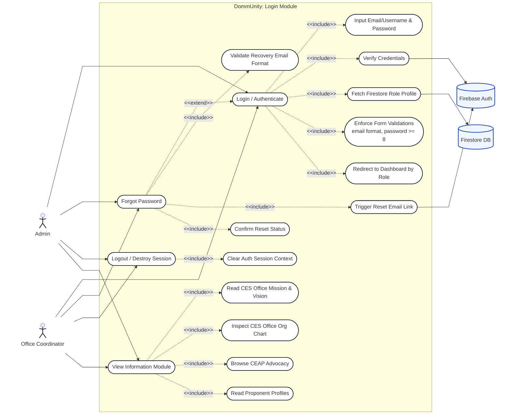
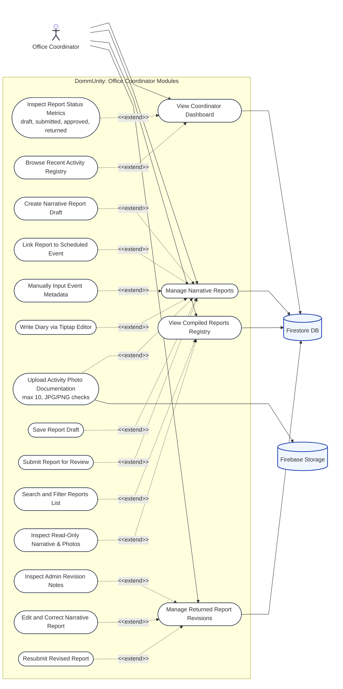
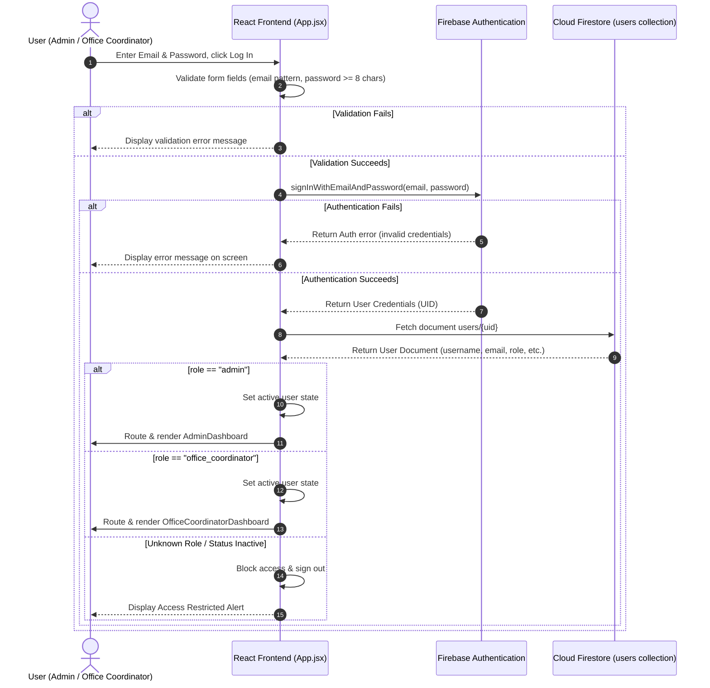
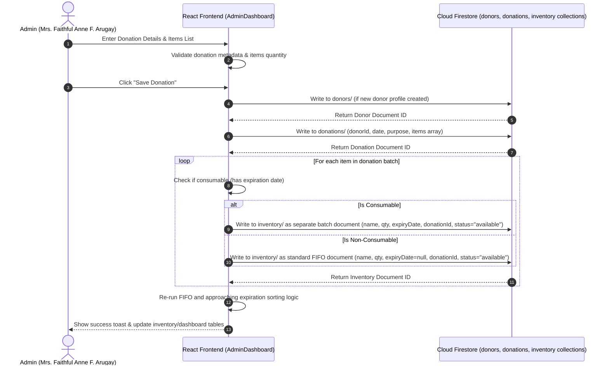
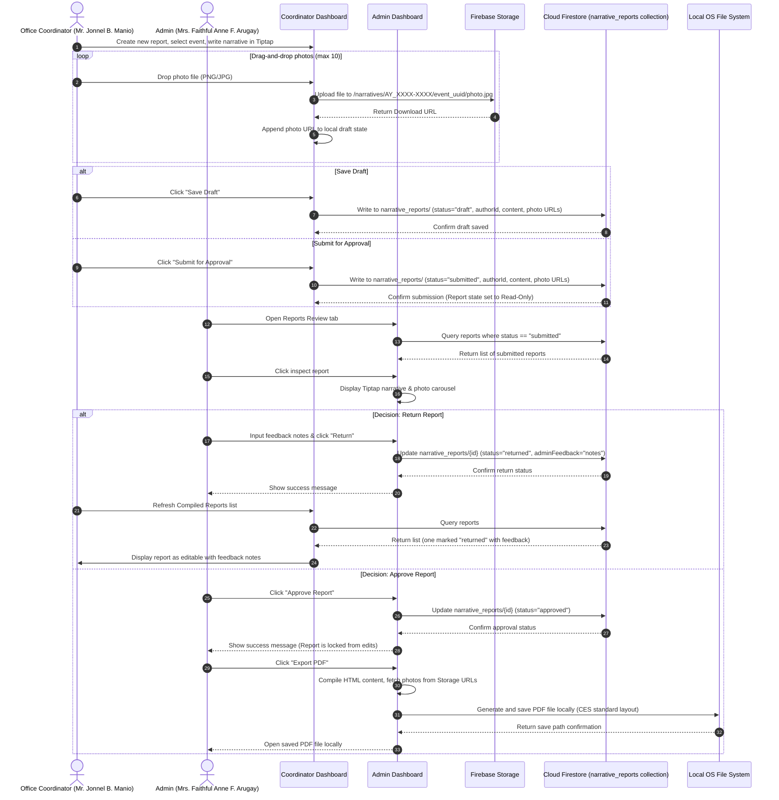

# System UML Diagrams: DommUnity

This document contains the Unified Modeling Language (UML) diagrams for **DommUnity**, reflecting the latest system implementation. All diagrams are designed using standard UML notation and rendered using Mermaid syntax.

---

## Functional Decomposition Diagram (FDD)

The Functional Decomposition Diagram (FDD) breaks down the **DommUnity** system into its high-level modules and sub-functions, illustrating the hierarchical structure of the system's operational capabilities.

> 🔗 **[Open in Draw.io (Native XML Diagram)](../drawio/fdd.drawio)** | **[View Functional Design Document (FDD)](./FDD.md)**

```mermaid
graph TD
    System[DommUnity System] --> Auth[Authentication & User Management]
    System --> Inv[Inventory Management]
    System --> Evt[Event & Department Coordination]
    System --> Dnr[Donor & Donation Management]
    System --> Rep[Narrative Reports Module]
    System --> Inf[Information & Reference Module]

    subgraph AuthModule [Authentication & User Management]
        Auth --> Auth1[Secure Credentials Login]
        Auth --> Auth2[Forgot Password Gateway]
        Auth --> Auth3[Admin User Creation Dashboard]
        Auth --> Auth4[Office Coordinator Access Control]
        Auth --> Auth5[Account Status Toggle]
        Auth --> Auth6[One Coordinator Constraint]
    end

    subgraph InvModule [Inventory Management]
        Inv --> Inv1[Item Catalog CRUD]
        Inv --> Inv2[Real-Time Stock Level Tracking]
        Inv --> Inv3[FIFO & Nearest-Expiry Sorting]
        Inv --> Inv4[Batch-Level Tracking Engine]
        Inv --> Inv5[Expiring Soon Alerts]
        Inv --> Inv6[Category & Unit Classifications]
        Inv --> Inv7[Search & Filtering Indicators]
        Inv --> Inv8[Inventory Summary Exports]
    end

    subgraph EvtModule [Event & Department Coordination]
        Evt --> Evt1[Calendar Event Scheduler]
        Evt --> Evt2[Department/Organization Profiles]
        Evt --> Evt3[Department-Event Mapper]
        Evt --> Evt4[Target Community Selection]
        Evt --> Evt5[Event Status Tracker Logs]
    end

    subgraph DnrModule [Donor & Donation Management]
        Dnr --> Dnr1[Donor Profile CRUD Database]
        Dnr --> Dnr2[Donation Batch Receipt Logger]
        Dnr --> Dnr3[Consumables Expiration Tracker]
    end

    subgraph RepModule [Narrative Reports Module]
        Rep --> Rep1[Report Semester & AY Selection]
        Rep --> Rep2[Scoped Department Event Selector]
        Rep --> Rep3[Tiptap Rich Text Diary Editor]
        Rep --> Rep4[Photo Upload max 10, PNG/JPG]
        Rep --> Rep5[Save Draft vs Submit Workflow]
        Rep --> Rep6[Submissions Review Queue]
        Rep --> Rep7[Returned Feedback Remarks]
        Rep --> Rep8[PDF/Word CES Compiler]
    end

    subgraph InfModule [Information & Reference Module]
        Inf --> Inf1[CES Institutional Info]
        Inf --> Inf2[CEAP JEEPGY Reference]
        Inf --> Inf3[Developer/Proponent Profiles]
    end

    %% Styling
    style System fill:#fff,stroke:#111827,stroke-width:2px;
    style Auth,Inv,Evt,Dnr,Rep,Inf fill:#fff,stroke:#111827,stroke-width:2px;
    classDef default fill:#fff,stroke:#111827,stroke-width:1px;
```



---

## 1. Use Case Diagrams

The operational capabilities of **DommUnity** are modeled below through three separate, detailed Use Case Diagrams. Every action, process, button trigger, validation rule, and Firebase database interaction is mapped within its respective boundary.

### 1.1 Login Module

This diagram maps out secure credentials verification, recovery links, logouts, and organizational profile lookups.

> 🔗 **[Open in Draw.io (Native XML Diagram)](../drawio/usecase_login.drawio)**



### 1.2 Admin Modules

This diagram details all administrative screens, logs, event managers, FIFO calculations, and report compilations.

> 🔗 **[Open in Draw.io (Native XML Diagram)](../drawio/usecase_admin.drawio)**

```mermaid
---
config:
  flowchart:
    curve: linear
---
flowchart LR
    subgraph LeftCol [ ]
        admin["<svg width='30' height='55' style='display:block;margin:auto;'><circle cx='15' cy='10' r='6' stroke='#111827' stroke-width='2' fill='none'/><line x1='15' y1='16' x2='15' y2='34' stroke='#111827' stroke-width='2'/><line x1='15' y1='22' x2='5' y2='20' stroke='#111827' stroke-width='2'/><line x1='15' y1='22' x2='25' y2='20' stroke='#111827' stroke-width='2'/><line x1='15' y1='34' x2='5' y2='48' stroke='#111827' stroke-width='2'/><line x1='15' y1='34' x2='25' y2='48' stroke='#111827' stroke-width='2'/></svg>Admin"]
    end

    %% System Boundary
    subgraph AdminModules [DommUnity: Admin Modules]
        %% Main Use Cases (Ovals)
        UC_DashView([View Dashboard Overview])
        UC_UserMgmt([Manage Coordinator Accounts])
        UC_Inventory([Manage Supplies Inventory])
        UC_DonorMgmt([Manage Donors & Donations])
        UC_EventMgmt([Manage Monthly Outreach Events])
        UC_OrgMgmt([Manage Department Profiles])
        UC_ReviewQueue([Review Narrative Queue])

        %% Dashboard Sub-Functions (Extends)
        UC_WidgetView([Inspect Summary Widgets<br/>coordinators, items, depts, donors])
        UC_ExpiryMonitor([Monitor Expiration Alert Panel<br/>batch counts expiring < 30 days])
        UC_FIFOSug([Review FIFO Release Recommendations])

        %% User Account Sub-Functions (Extends)
        UC_CreateCoord([Create Coordinator Account<br/>Name, Email, Username, assigned organization])
        UC_UpdateCoord([Update Account Fields])
        UC_ToggleCoord([Toggle Account Active/Inactive])
        UC_RegistryCoord([View Coords Search Registry])
        UC_EnforceOne([Enforce One Coordinator Constraint])
        UC_ResetPwdReq([Handle Forgot Password Reset Requests])

        %% Inventory Sub-Functions (Extends)
        UC_AddBatch([Add Supply Item Batch<br/>Name, Category, Unit, Quantity, Expiry])
        UC_UpdateBatch([Update Supply Item Batch])
        UC_DeleteBatch([Delete Supply Item Batch])
        UC_ReleaseFIFO([Process Supply Stock Release<br/>FIFO allocation])
        UC_CustomCatUnit([Manage Custom Categories & Units])
        UC_ExportInvPDF([Export Inventory Report PDF/Word])

        %% Donor Sub-Functions (Extends)
        UC_AddDonor([Log Donor Profile<br/>Name, Contact Email/Phone, Type])
        UC_UpdateDonor([Update Donor Profile])
        UC_DeleteDonor([Delete Donor Profile])
        UC_LogDonation([Log Donation Batch<br/>donor lookup, purpose, items array])

        %% Event Sub-Functions (Extends)
        UC_ScheduleEvent([Schedule Event<br/>Title, Description, Date/Time, Location])
        UC_MapEvent([Map/Assign Event to Organization])
        UC_StatusEvent([Update Event Status<br/>planned/ongoing/completed/cancelled])
        UC_CalendarEvent([View Monthly Calendar Board])

        %% Organization Sub-Functions (Extends)
        UC_CreateOrg([Create Organization Profile<br/>Name, Abbreviation, Description, Logo])
        UC_UpdateOrg([Update Organization Profile])
        UC_DeleteOrg([Delete Organization Profile])
        UC_LinkOrgCoord([Assign Department Coordinator])

        %% Report Review Sub-Functions (Extends)
        UC_InspectReport([Inspect Submitted Diaries & Photo Gallery])
        UC_ApproveReport([Approve Narrative Submission<br/>locks Firestore document])
        UC_ReturnReport([Return Narrative with Written Feedback])
        UC_CompileReport([Compile Narrative Report PDF/Word<br/>CES layout format])
    end

    subgraph RightCol [ ]
        firestore[(Firestore DB)]
    end

    %% Left Connections (Admin to Main Use Cases)
    admin --> UC_DashView
    admin --> UC_UserMgmt
    admin --> UC_Inventory
    admin --> UC_DonorMgmt
    admin --> UC_EventMgmt
    admin --> UC_OrgMgmt
    admin --> UC_ReviewQueue

    %% Extends Connections (Sub-Functions to Main)
    UC_WidgetView -.->|&lt;&lt;extend&gt;&gt;| UC_DashView
    UC_ExpiryMonitor -.->|&lt;&lt;extend&gt;&gt;| UC_DashView
    UC_FIFOSug -.->|&lt;&lt;extend&gt;&gt;| UC_DashView

    UC_CreateCoord -.->|&lt;&lt;extend&gt;&gt;| UC_UserMgmt
    UC_UpdateCoord -.->|&lt;&lt;extend&gt;&gt;| UC_UserMgmt
    UC_ToggleCoord -.->|&lt;&lt;extend&gt;&gt;| UC_UserMgmt
    UC_RegistryCoord -.->|&lt;&lt;extend&gt;&gt;| UC_UserMgmt
    UC_EnforceOne -.->|&lt;&lt;extend&gt;&gt;| UC_UserMgmt
    UC_ResetPwdReq -.->|&lt;&lt;extend&gt;&gt;| UC_UserMgmt

    UC_AddBatch -.->|&lt;&lt;extend&gt;&gt;| UC_Inventory
    UC_UpdateBatch -.->|&lt;&lt;extend&gt;&gt;| UC_Inventory
    UC_DeleteBatch -.->|&lt;&lt;extend&gt;&gt;| UC_Inventory
    UC_ReleaseFIFO -.->|&lt;&lt;extend&gt;&gt;| UC_Inventory
    UC_CustomCatUnit -.->|&lt;&lt;extend&gt;&gt;| UC_Inventory
    UC_ExportInvPDF -.->|&lt;&lt;extend&gt;&gt;| UC_Inventory

    UC_AddDonor -.->|&lt;&lt;extend&gt;&gt;| UC_DonorMgmt
    UC_UpdateDonor -.->|&lt;&lt;extend&gt;&gt;| UC_DonorMgmt
    UC_DeleteDonor -.->|&lt;&lt;extend&gt;&gt;| UC_DonorMgmt
    UC_LogDonation -.->|&lt;&lt;extend&gt;&gt;| UC_DonorMgmt

    UC_ScheduleEvent -.->|&lt;&lt;extend&gt;&gt;| UC_EventMgmt
    UC_MapEvent -.->|&lt;&lt;extend&gt;&gt;| UC_EventMgmt
    UC_StatusEvent -.->|&lt;&lt;extend&gt;&gt;| UC_EventMgmt
    UC_CalendarEvent -.->|&lt;&lt;extend&gt;&gt;| UC_EventMgmt

    UC_CreateOrg -.->|&lt;&lt;extend&gt;&gt;| UC_OrgMgmt
    UC_UpdateOrg -.->|&lt;&lt;extend&gt;&gt;| UC_OrgMgmt
    UC_DeleteOrg -.->|&lt;&lt;extend&gt;&gt;| UC_OrgMgmt
    UC_LinkOrgCoord -.->|&lt;&lt;extend&gt;&gt;| UC_OrgMgmt

    UC_InspectReport -.->|&lt;&lt;extend&gt;&gt;| UC_ReviewQueue
    UC_ApproveReport -.->|&lt;&lt;extend&gt;&gt;| UC_ReviewQueue
    UC_ReturnReport -.->|&lt;&lt;extend&gt;&gt;| UC_ReviewQueue
    UC_CompileReport -.->|&lt;&lt;extend&gt;&gt;| UC_ReviewQueue

    %% Right Connections (Main Use Cases to Database)
    UC_DashView --> firestore
    UC_UserMgmt --> firestore
    UC_Inventory --> firestore
    UC_DonorMgmt --> firestore
    UC_EventMgmt --> firestore
    UC_OrgMgmt --> firestore
    UC_ReviewQueue --> firestore

    %% Styles
    style LeftCol fill:none,stroke:none
    style RightCol fill:none,stroke:none
    style admin fill:none,stroke:none
    classDef usecase fill:#fff,stroke:#374151,stroke-width:1.5px;
    classDef database fill:#eff6ff,stroke:#1e40af,stroke-width:2px;
    class UC_DashView,UC_UserMgmt,UC_Inventory,UC_DonorMgmt,UC_EventMgmt,UC_OrgMgmt,UC_ReviewQueue,UC_WidgetView,UC_ExpiryMonitor,UC_FIFOSug,UC_CreateCoord,UC_UpdateCoord,UC_ToggleCoord,UC_RegistryCoord,UC_EnforceOne,UC_ResetPwdReq,UC_AddBatch,UC_UpdateBatch,UC_DeleteBatch,UC_ReleaseFIFO,UC_CustomCatUnit,UC_ExportInvPDF,UC_AddDonor,UC_UpdateDonor,UC_DeleteDonor,UC_LogDonation,UC_ScheduleEvent,UC_MapEvent,UC_StatusEvent,UC_CalendarEvent,UC_CreateOrg,UC_UpdateOrg,UC_DeleteOrg,UC_LinkOrgCoord,UC_InspectReport,UC_ApproveReport,UC_ReturnReport,UC_CompileReport usecase;
    class firestore database;
```



### 1.3 Office Coordinator Modules

This diagram details the report compilation and submission workflow for the Office Coordinator.

> 🔗 **[Open in Draw.io (Native XML Diagram)](../drawio/usecase_coordinator.drawio)**


```

---

## 2. Activity Diagrams

Activity Diagrams model the control flow and sequential activities within critical business processes of the system. The diagrams below are styled as standard UML activity diagrams. By utilizing Mermaid's modern YAML frontmatter configuration block (`curve: step`), all connector lines are rendered as strictly straight, sharp horizontal and vertical segments with non-curved 90-degree turns.

### 2.1 User Authentication & Session Lifecycle

This workflow handles app launch, input validation, credentials check via Firebase Auth, database role querying, and routing.

> 🔗 **[Open in Draw.io (Native XML Diagram)](../drawio/activity_auth_lifecycle.drawio)**

```mermaid
---
config:
  flowchart:
    curve: step
---
flowchart TD
    startNode(( )) --> AppLaunched["User Launches DommUnity Application"]
    AppLaunched --> LoginScreenDisplayed["Login Screen is Displayed"]
    
    LoginScreenDisplayed --> fork_login[" "]
    
    subgraph LoginCol ["Authentication Process"]
        EnterCredentials["Input Email/Username & Password"] --> CheckFormat{Validate inputs?}
        CheckFormat -->|No| ShowFormatError["Show Format Error"]
        ShowFormatError --> EnterCredentials
        CheckFormat -->|Yes| CallAuthAPI["Request Firebase Auth Sign-in"]
        CallAuthAPI --> VerifyAuth{Are credentials correct?}
        VerifyAuth -->|No| ShowAuthError["Show Auth Error"]
        ShowAuthError --> EnterCredentials
        VerifyAuth -->|Yes| FetchProfile["Fetch Firestore User Profile"]
        FetchProfile --> CheckRole{Check Role}
        CheckRole -->|admin| AdminRoute["Route to Admin Dashboard"]
        CheckRole -->|office_coordinator| CoordRoute["Route to Coordinator Dashboard"]
    end
    
    subgraph RecoveryCol ["Password Recovery"]
        EnterRecoveryEmail["Input Recovery Email"] --> CheckRecoveryEmail{Is email valid format?}
        CheckRecoveryEmail -->|No| ShowRecoveryError["Show Recovery Error"]
        ShowRecoveryError --> EnterRecoveryEmail
        CheckRecoveryEmail -->|Yes| CallResetAPI["Send Password Reset link"]
        CallResetAPI --> ShowSuccessConfirmation["Show Success Confirmation"]
    end
    
    subgraph InfoCol ["Information Module"]
        ReadMV["Read Mission & Vision"] --> InspectOrgChart["Inspect Org Chart"]
        InspectOrgChart --> BrowseJEEPGY["Browse CEAP JEEPGY Advocacy Areas"]
        BrowseJEEPGY --> ReadDeveloperInfo["Read Developer Profiles"]
    end
    
    fork_login --> EnterCredentials
    fork_login --> EnterRecoveryEmail
    fork_login --> ReadMV
    
    AdminRoute --> join_login[" "]
    CoordRoute --> join_login
    ShowSuccessConfirmation --> join_login
    ReadDeveloperInfo --> join_login
    
    join_login --> endNode((( )))
    
    %% Styles
    classDef startState fill:#000,stroke:#000;
    classDef endState fill:#000,stroke:#000;
    classDef forkStyle fill:#000,stroke:#000,stroke-width:4px;
    class startNode startState;
    class endNode endState;
    class fork_login,join_login forkStyle;
```



### 2.2 Admin Dashboard Workflows

This diagram models the parallel execution paths available in the Admin workspace, directly reflecting the structure of the dashboard panels.

> 🔗 **[Open in Draw.io (Native XML Diagram)](../drawio/activity_admin_workflows.drawio)**

```mermaid
---
config:
  flowchart:
    curve: step
---
flowchart TD
    startNode(( )) --> AdminDashboardDisplayed["Admin Dashboard is Displayed"]
    
    AdminDashboardDisplayed --> fork_db[" "]
    
    subgraph UserMgmtCol ["User Management"]
        OpenUserMgmt["Opens User Management"] --> fork_user[" "]
        fork_user --> AddEditUser["Add / Edit User"]
        fork_user --> DeactivateUser["Deactivate User"]
        AddEditUser --> join_user[" "]
        DeactivateUser --> join_user
    end
    
    subgraph InvMgmtCol ["Inventory Management"]
        OpenInvMgmt["Opens Inventory Management"] --> ManageItems["Manage Items"]
        ManageItems --> fork_inv[" "]
        fork_inv --> TrackStock["Track Stock"]
        fork_inv --> PrintReport["Print Report"]
        TrackStock --> join_inv[" "]
        PrintReport --> join_inv
    end
    
    subgraph EventMgmtCol ["Event Management"]
        OpenEvtMgmt["Opens Event Management"] --> fork_evt[" "]
        fork_evt --> AddSchedule["Add Schedule"]
        fork_evt --> UpdateStatus["Update Status"]
        AddSchedule --> join_evt[" "]
        UpdateStatus --> join_evt
    end
    
    subgraph OrgMgmtCol ["Organization Management"]
        OpenOrgMgmt["Opens Organization Management"] --> CreateDeptProfile["Create Dept Profile"]
        CreateDeptProfile --> AssignEvents["Assign Events"]
    end
    
    subgraph DonorMgmtCol ["Donor Management"]
        OpenDonorMgmt["Opens Donor Management"] --> InputDonorItems["Input Donor & Items"]
        InputDonorItems --> fork_dnr[" "]
        fork_dnr --> CheckItems["Check Items"]
        fork_dnr --> ConsumableChoice{Is item consumable?}
        ConsumableChoice -->|Yes| InputExpiration["Input Expiration Date"]
        ConsumableChoice -->|No| join_dnr[" "]
        InputExpiration --> join_dnr
        CheckItems --> join_dnr
    end
    
    subgraph ReportMgmtCol ["Report Management"]
        OpenReportMgmt["Opens Report Management"] --> fork_rep[" "]
        fork_rep --> ViewNarrativeReports["View Narrative Reports"]
        fork_rep --> ExportPrintFormats["Export / Print Formats"]
        ViewNarrativeReports --> join_rep[" "]
        ExportPrintFormats --> join_rep
    end

    fork_db --> OpenUserMgmt
    fork_db --> OpenInvMgmt
    fork_db --> OpenEvtMgmt
    fork_db --> OpenOrgMgmt
    fork_db --> OpenDonorMgmt
    fork_db --> OpenReportMgmt
    
    join_user --> join_db[" "]
    join_inv --> join_db
    join_evt --> join_db
    AssignEvents --> join_db
    join_dnr --> join_db
    join_rep --> join_db
    
    join_db --> endNode((( )))
    
    %% Styles
    classDef startState fill:#000,stroke:#000;
    classDef endState fill:#000,stroke:#000;
    classDef forkStyle fill:#000,stroke:#000,stroke-width:4px;
    class startNode startState;
    class endNode endState;
    class fork_db,fork_user,join_user,fork_inv,join_inv,fork_evt,join_evt,fork_dnr,join_dnr,fork_rep,join_rep,join_db forkStyle;
```



### 2.3 Office Coordinator Dashboard Workflows

This diagram models the workflows of the Office Coordinator workspace, focusing purely on user actions: creating reports (including diary text and photo attachment limit checks) and checking status history.

> 🔗 **[Open in Draw.io (Native XML Diagram)](../drawio/activity_coordinator_workflows.drawio)**

```mermaid
---
config:
  flowchart:
    curve: step
---
flowchart TD
    startNode(( )) --> CoordinatorDashboardDisplayed["Coordinator Dashboard is Displayed"]
    
    CoordinatorDashboardDisplayed --> fork_dashboard[" "]
    
    subgraph ReportCreationCol ["Report Creation"]
        OpensReportCreation["Opens Report Creation"] --> fork_creation[" "]
        fork_creation --> WriteDiaryNarrative["Write Diary Narrative"]
        fork_creation --> UploadEventPhotos["Upload Event Photos"]
        UploadEventPhotos --> PhotoCountCheck{More than 10 photos?}
        PhotoCountCheck -->|Yes| ShowLimitError["Show Limit Error"]
        ShowLimitError --> UploadEventPhotos
        PhotoCountCheck -->|No| SubmitCompletedReport["Submit Completed Report"]
        WriteDiaryNarrative --> join_creation[" "]
        SubmitCompletedReport --> join_creation
    end
    
    subgraph ReportHistoryCol ["Report Status & History"]
        OpensReportStatusHistory["Opens Report Status & History"] --> FilterSemesterEvent["Filter by Semester or Event"]
        FilterSemesterEvent --> fork_status[" "]
        fork_status --> ViewDraftStatus["View Draft Status"]
        fork_status --> ViewApprovedReturnedStatus["View Approved / Returned Status"]
        ViewDraftStatus --> join_status[" "]
        ViewApprovedReturnedStatus --> join_status
    end
    
    fork_dashboard --> OpensReportCreation
    fork_dashboard --> OpensReportStatusHistory
    
    join_creation --> join_dashboard[" "]
    join_status --> join_dashboard
    
    join_dashboard --> endNode((( )))
    
    %% Styles
    classDef startState fill:#000,stroke:#000;
    classDef endState fill:#000,stroke:#000;
    classDef forkStyle fill:#000,stroke:#000,stroke-width:4px;
    class startNode startState;
    class endNode endState;
    class fork_dashboard,fork_creation,join_creation,fork_status,join_status,join_dashboard forkStyle;
```




---

## 3. Sequence Diagrams

Sequence Diagrams capture the system component interactions, API requests, and message passing between the React frontend, Firebase services (Auth, Firestore, Storage), and the local desktop shell.

### 3.1 Scenario A: Authentication & Role Redirection Gateway

This diagram illustrates the step-by-step user credentials validation and role routing flow.

> 🔗 **[Open in Draw.io (Native XML Diagram)](../drawio/sequence_auth_redirection.drawio)**



### 3.2 Scenario B: Donation Log and FIFO Batch-Level Inventory Update

This sequence describes logging a donation and inserting separated batch items into Firestore to maintain inventory FIFO order.

> 🔗 **[Open in Draw.io (Native XML Diagram)](../drawio/sequence_donation_fifo.drawio)**



### 3.3 Scenario C: Narrative Report Life-Cycle (Create -> Submit -> Return/Approve -> PDF Export)

This sequence follows the complete narrative lifecycle from text and image processing to state transitions and compiling.

> 🔗 **[Open in Draw.io (Native XML Diagram)](../drawio/sequence_report_lifecycle.drawio)**


