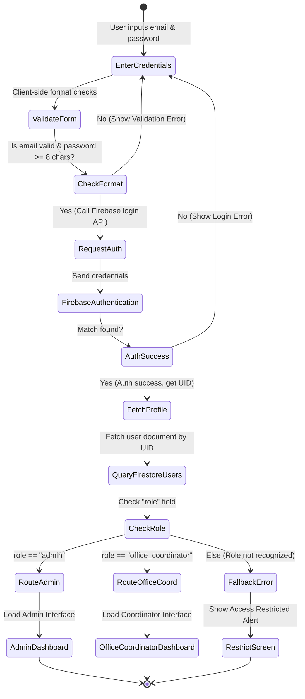
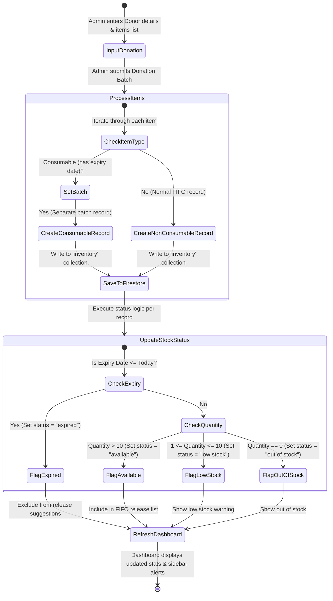
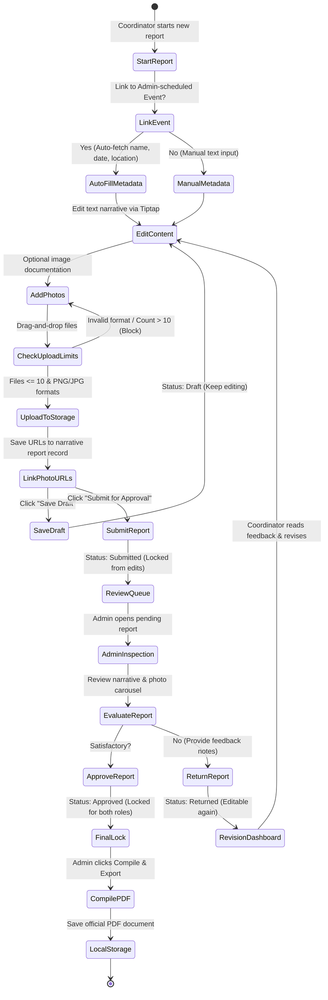
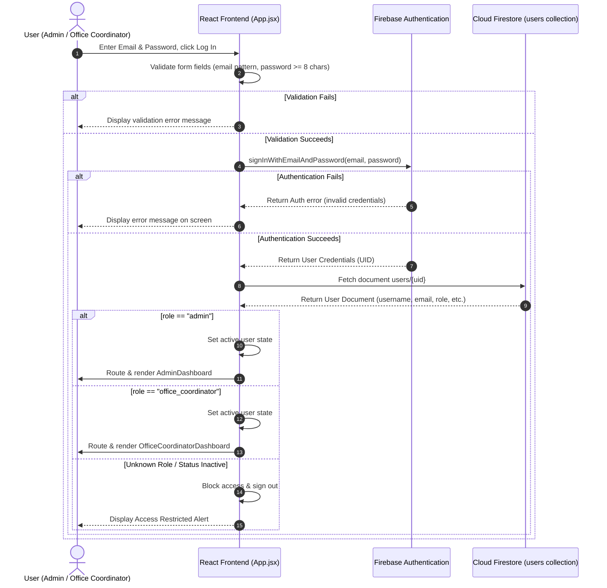
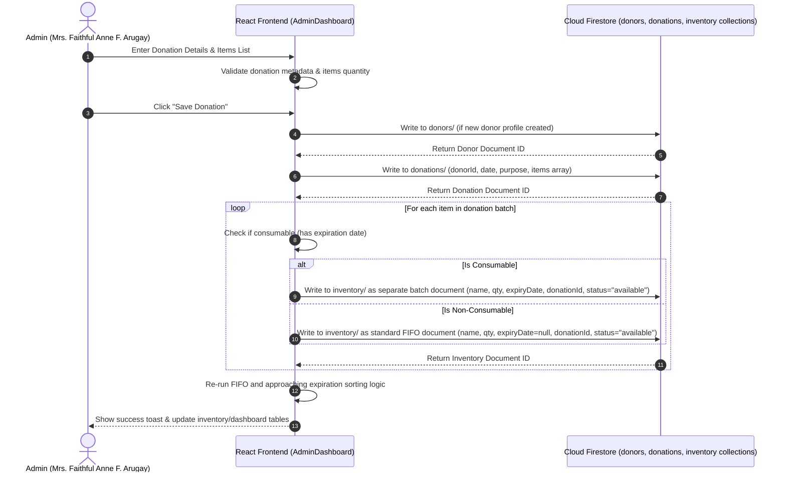
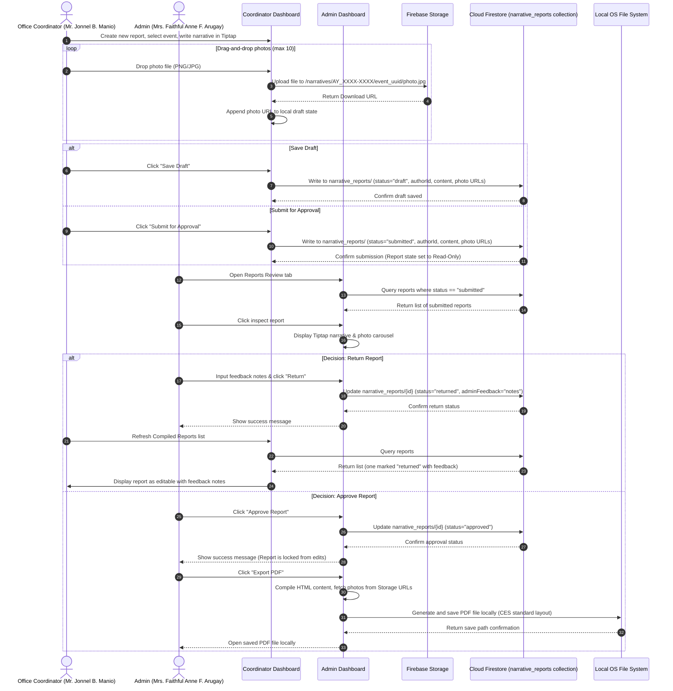

# System UML Diagrams: DommUnity

This document contains the Unified Modeling Language (UML) diagrams for **DommUnity**, reflecting the latest system implementation. All diagrams are designed using standard UML notation and rendered using Mermaid syntax.

---

## 1. Use Case Diagram

The Use Case Diagram defines the roles and operational boundaries of the system. It shows how the two primary roles (**Admin** and **Office Coordinator**) interact with system modules and how these actions translate to the backend **Firebase** database, authentication, and storage services.

```mermaid
flowchart LR
    %% Actors
    subgraph Actors [Actors]
        admin((Admin))
        coordinator((Office Coordinator))
    end

    %% External Systems
    subgraph ExternalSystems [External Services]
        fbAuth[Firebase Authentication]
        firestore[Firestore Database]
        fbStorage[Firebase Storage]
    end

    %% System Boundary
    subgraph DommUnitySystem [DommUnity Desktop System]
        %% Shared / Auth Use Cases
        UC_Login(Login / Authenticate)
        UC_VerifyCreds(Verify Credentials)
        UC_ForgotPwd(Forgot Password)
        UC_Logout(Logout)
        UC_Info(View CES Info & Developer Profiles)

        %% Admin-Only Use Cases
        UC_UserMgmt(Manage Coordinator Accounts)
        UC_ToggleStatus(Toggle Account Active / Inactive)
        UC_ResetPwdReq(Handle Password Reset Requests)
        
        UC_Inventory(Manage Supplies Inventory)
        UC_FIFORecommend(Evaluate FIFO & Expiration Priority)
        UC_ReleaseStock(Process Inventory Stock Release)
        UC_ExportInv(Export Inventory Report to PDF/Word)
        
        UC_Donors(Manage Donors & Donations)
        UC_LogDonation(Record Donation Batch)
        UC_TrackShelfLife(Monitor Shelf-life of Consumables)
        
        UC_Events(Schedule Monthly Outreach Events)
        UC_AssignDept(Map Events to Departments)
        
        UC_Orgs(Manage Organizations & Departments)
        
        UC_ReviewReport(Review Narrative Submissions)
        UC_ApproveReport(Approve & Lock Report)
        UC_ReturnReport(Return with Revision Feedback)

        %% Office Coordinator-Only Use Cases
        UC_DashMetrics(View Report Status Metrics)
        UC_WriteReport(Compose Narrative Reports)
        UC_LinkEvent(Link Report to Scheduled Event)
        UC_TiptapEditor(Write Narrative in Tiptap Rich Text)
        UC_PhotoUpload(Upload Activity Photos<br/>Max 10 JPG/PNG)
        UC_SaveDraft(Save Report as Draft)
        UC_SubmitReport(Submit for Review)
        UC_ReviseReport(Revise Returned Reports)
    end

    %% Admin Relationships
    admin --> UC_Login
    admin --> UC_Info
    admin --> UC_Logout
    admin --> UC_UserMgmt
    admin --> UC_Inventory
    admin --> UC_Donors
    admin --> UC_Events
    admin --> UC_Orgs
    admin --> UC_ReviewReport

    %% Coordinator Relationships
    coordinator --> UC_Login
    coordinator --> UC_Info
    coordinator --> UC_Logout
    coordinator --> UC_DashMetrics
    coordinator --> UC_WriteReport
    coordinator --> UC_ReviseReport

    %% Include / Extend Relationships
    UC_Login -.-->|&lt;&lt;include&gt;&gt;| UC_VerifyCreds
    UC_ForgotPwd -.-->|&lt;&lt;extend&gt;&gt;| UC_Login
    
    UC_UserMgmt -.-->|&lt;&lt;include&gt;&gt;| UC_ToggleStatus
    UC_UserMgmt -.-->|&lt;&lt;include&gt;&gt;| UC_ResetPwdReq
    
    UC_Inventory -.-->|&lt;&lt;include&gt;&gt;| UC_FIFORecommend
    UC_Inventory -.-->|&lt;&lt;include&gt;&gt;| UC_ReleaseStock
    UC_Inventory -.-->|&lt;&lt;include&gt;&gt;| UC_ExportInv
    
    UC_Donors -.-->|&lt;&lt;include&gt;&gt;| UC_LogDonation
    UC_Donors -.-->|&lt;&lt;include&gt;&gt;| UC_TrackShelfLife
    
    UC_Events -.-->|&lt;&lt;include&gt;&gt;| UC_AssignDept
    
    UC_ReviewReport -.-->|&lt;&lt;include&gt;&gt;| UC_ApproveReport
    UC_ReviewReport -.-->|&lt;&lt;include&gt;&gt;| UC_ReturnReport
    UC_ReviewReport -.-->|&lt;&lt;include&gt;&gt;| UC_ExportInv
    
    UC_WriteReport -.-->|&lt;&lt;include&gt;&gt;| UC_LinkEvent
    UC_WriteReport -.-->|&lt;&lt;include&gt;&gt;| UC_TiptapEditor
    UC_WriteReport -.-->|&lt;&lt;include&gt;&gt;| UC_PhotoUpload
    
    UC_SaveDraft -.-->|&lt;&lt;extend&gt;&gt;| UC_WriteReport
    UC_SubmitReport -.-->|&lt;&lt;extend&gt;&gt;| UC_WriteReport

    %% External Systems Relationships
    UC_VerifyCreds -.-> fbAuth
    UC_ResetPwdReq -.-> fbAuth
    UC_ForgotPwd -.-> fbAuth
    
    UC_UserMgmt -.-> firestore
    UC_Inventory -.-> firestore
    UC_Donors -.-> firestore
    UC_Events -.-> firestore
    UC_Orgs -.-> firestore
    UC_ReviewReport -.-> firestore
    UC_DashMetrics -.-> firestore
    UC_WriteReport -.-> firestore
    UC_ReviseReport -.-> firestore
    
    UC_PhotoUpload -.-> fbStorage

    %% Styles
    classDef actor fill:#dcfce7,stroke:#166534,stroke-width:2px,color:#166534;
    classDef system fill:#eff6ff,stroke:#1e40af,stroke-width:2px,color:#1e40af;
    classDef usecase fill:#fff,stroke:#374151,stroke-width:1.5px,color:#111827;

    class admin,coordinator actor;
    class fbAuth,firestore,fbStorage system;
    class UC_Login,UC_VerifyCreds,UC_ForgotPwd,UC_Logout,UC_Info,UC_UserMgmt,UC_ToggleStatus,UC_ResetPwdReq,UC_Inventory,UC_FIFORecommend,UC_ReleaseStock,UC_ExportInv,UC_Donors,UC_LogDonation,UC_TrackShelfLife,UC_Events,UC_AssignDept,UC_Orgs,UC_ReviewReport,UC_ApproveReport,UC_ReturnReport,UC_DashMetrics,UC_WriteReport,UC_LinkEvent,UC_TiptapEditor,UC_PhotoUpload,UC_SaveDraft,UC_SubmitReport,UC_ReviseReport usecase;
```

---

## 2. Activity Diagrams

Activity Diagrams model the control flow and sequential activities within critical business processes of the system.

### 2.1 User Authentication and Dashboard Routing

This workflow handles the process from user login request to validating user roles and mounting the dashboard.



### 2.2 Donation Receipt and FIFO Stock Tracking

This workflow models the inventory collection updates, splitting consumable batches, and identifying availability, low stock, or expired items.



### 2.3 Narrative Report Compilation and Approval Lifecycle

This workflow documents report drafting, photo attachments limits, submission locks, and the admin feedback loop.



---

## 3. Sequence Diagrams

Sequence Diagrams capture the system component interactions, API requests, and message passing between the React frontend, Firebase services (Auth, Firestore, Storage), and the local desktop shell.

### 3.1 Scenario A: Authentication & Role Redirection Gateway

This diagram illustrates the step-by-step user credentials validation and role routing flow.



### 3.2 Scenario B: Donation Log and FIFO Batch-Level Inventory Update

This sequence describes logging a donation and inserting separated batch items into Firestore to maintain inventory FIFO order.



### 3.3 Scenario C: Narrative Report Life-Cycle (Create -> Submit -> Return/Approve -> PDF Export)

This sequence follows the complete narrative lifecycle from text and image processing to state transitions and compiling.


